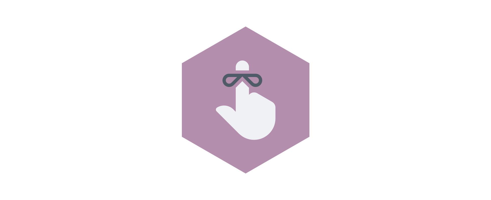

<h1 align="center">redux-whenever.js</h1>

<div align="center">
 
</div>

<br>

Subscribe to a state subtree (or leaf) and run callbacks whenever it evaluates to a given value.
No need to check for previous and current state anymore 🎉🎉🎉.

## Usage

### Adding subscriber

```js
const reduxWhenever = require('@caiogondim/redux-whenever')
const redux = require('redux')

// Pass `reduxWhenever` as an enhancer
const store = redux.createStore(reducer, reduxWhenever)

// Callback receives current and previous state subtree (or leaf).
// You might not be interested in the state at all, since the callback will only be executed if
// the given assertion is true.
const callback = (curStateSubtree, prevStateSubtree) => {
  // ...
}

// Pass the state selector you are interested in as a string.
// `callback` will execute only when `player.isReady` becames `true`
store.whenever('player.isReady', true, callback)
```

### Removing subscriber
```js
const unsubscribe = store.whenever('player.isReady', true, callback)
unsubscribe() // Removes previously added listener
```

## API

### `const unsubscribe = store.whenever(selector, assertion, callback)`
Returns a function that, if called, removes the added subscriber.

#### `selector`
- type: `String|Function`

Should return a piece of the state tree

#### `assertion`
- type: `String|Number|Object|Function`
- If a

#### `callback`
- type: `Function`

## Installation

```
npm install --save @caiogondim/redux-whenever
```

## Credits
- Icon by Scott Lewis from the Noun Project

---

[caiogondim.com](https://caiogondim.com) &nbsp;&middot;&nbsp;
GitHub [@caiogondim](https://github.com/caiogondim) &nbsp;&middot;&nbsp;
Twitter [@caio_gondim](https://twitter.com/caio_gondim)
